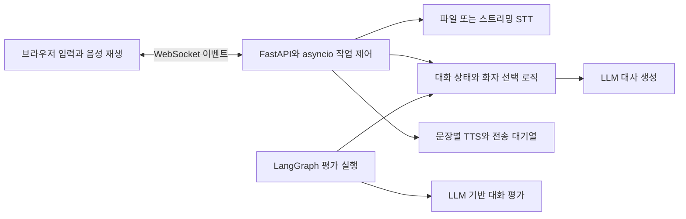

# Banter | 3자 실시간 음성 대화

**사용자 한 명과 AI 페르소나 두 명이 대화하며, 사용자의 끼어들기를 처리하는 음성 대화 시스템입니다.**

실시간 서버: Python, FastAPI, asyncio, WebSocket

평가: LangGraph, LLM 기반 시나리오 채점

AI 둘이 대화를 이어가는 동안 사용자가 참여하면, 재생 중인 소리와 생성 중인 답변을 함께
제어해야 합니다. Banter는 발화권, 늦게 도착한 음성 결과, 다음 턴의 재생 시점을 애플리케이션에서
관리합니다. STT는 음성을 텍스트로, LLM은 대사를, TTS는 대사를 음성으로 변환합니다.

## 문서로 살펴보기

| 확인할 내용 | 읽을 곳 |
| --- | --- |
| 어떤 문제를 어떤 구조로 해결했는가 | 아래 대화 흐름과 구조, [문제 해결 사례](docs/project-walkthrough.md) |
| 기술을 왜 선택했고 어떤 대가가 있는가 | [기술별 역할](docs/project-walkthrough.md#기술의-역할과-선택-이유), [설계 결정](docs/decisions.md) |
| 실제로 무엇을 검증했는가 | 아래 검증 상태, [실험 기록](docs/experiments/README.md), 사례별 코드와 테스트 링크 |
| 어떤 실패를 겪고 무엇을 바꿨는가 | [실패와 개선 기록](docs/failures.md): 증상, 원인, 선택한 개선과 확인 범위 |

실행 없이 설계와 근거를 읽을 수 있으며, 직접 확인하려면 아래 키 없는 실행과 자동 테스트를
사용할 수 있습니다. 실제 음성 경험은 별도 공급자 설정과 실사용 검증이 필요합니다.

## 대화 흐름

- 사용자는 도현과 소은의 대화를 듣거나, 텍스트 또는 마이크로 참여합니다.
- 기본 마이크 조작은 누르는 동안 말하는 push-to-talk입니다. 입력 시작 시 브라우저가 먼저
  재생을 멈추고 서버에 발언권 요청을 보냅니다. 최종 전사가 나오면 대화 이력에 반영합니다.
- 선택 기능인 VAD는 말의 시작과 끝을 감지합니다. 마이크를 한 번 켠 뒤 말로 참여할 수 있도록
  기존 중단과 전사 경로를 연결했습니다. 실제 환경의 편의와 오감지 비용은 비교 측정 전입니다.
- 음성 화면은 현재 재생 중인 화자와 마이크 상태를 보여줍니다. 텍스트 입력은 필요할 때 펼치며,
  음성 출력이 없거나 재생에 실패하면 대화 기록을 확인할 수 있습니다. [화면 설명](web/README.md)

## 문제와 구현한 처리

| 문제 | 구현한 처리 | 확인 근거 |
| --- | --- | --- |
| AI가 답변을 만드는 중에도 사용자 개입을 받아야 함 | 응답 생성과 사전 생성 대기 중 입력을 함께 처리. 개입 시 생성 취소와 이전 결과 폐기를 적용하고, 말 시작 시 전사 대기로 전환 | [생성과 전사 회귀](server/tests/test_api.py), [사전 생성 대기 회귀](server/tests/test_prefetch.py) |
| 화자 선택, 대사 생성과 음성 합성을 순서대로 기다리며 응답 준비가 길어짐 | 화자 선택과 대사를 단일 LLM 호출로 통합하고 완성된 문장부터 합성. AI끼리의 다음 발화는 현재 음성 재생 중 준비 | [통합 생성 비교](docs/experiments/judge-scores.md), [지연 관찰](docs/experiments/latency.md) |
| 서버의 생성 속도와 브라우저의 재생 속도가 다름 | 음성 순번과 브라우저의 처리 완료 신호로 다음 AI 턴의 진행을 조절하고, 확인 유실에는 제한 시간을 적용 | [재생 처리](web/index.html), [서버와 웹 테스트](web/tests/index-state.test.mjs) |

취소는 앱 내부 작업에 요청합니다. 외부 공급자의 연산이나 과금이 즉시 멈췄다는 보장은 없으므로,
이미 시작된 합성이 나중에 완료되더라도 이전 결과를 전송하지 않도록 따로 검사합니다.

## 구조



실시간 서버는 공유 대화 함수를 직접 조합하고 `asyncio`로 입력, 생성과 합성 작업을 제어합니다.
LangGraph는 화자 선택, 발화 생성과 상태 갱신을 그래프로 구성하여 평가 시나리오를 실행하는 데
사용합니다. 기술 선택과 대안은 [설계 결정](docs/decisions.md)에 정리했습니다.

## 검증 상태

| 범위 | 확인한 내용 | 해석 범위 |
| --- | --- | --- |
| 자동 회귀 테스트 | 마지막 전체 검증에서 Python 257개, 웹 124개 통과 | 가짜 공급자와 제어된 이벤트로 동작과 복구를 확인. 실제 음성 품질 수치가 아님 |
| 화자 선택과 생성 통합 | 시나리오별 3회 평가에서 사용자 참여 8.08에서 8.33, AI 대화 8.26에서 8.47 | 두 종합점수가 당시 이행 기준을 통과해 정상 경로의 호출을 2회에서 1회로 줄임. 항목별 점수는 엇갈리며 통계적 우위나 비용 절감률은 미확인 |
| AI 발화 사이 간격 | 로컬 3턴에서 1.52, 2.88, 1.87초 관찰 | 재생 확인부터 다음 오디오 도착까지. 대화 대기 설정도 함께 바뀌어 prefetch 단독 효과로 해석하지 않음 |
| 스트리밍 STT와 VAD | 선택 모드, 오류 복구와 측정 도구 구현 | 실제 전사 연결 재확인, 인식률, 끼어들기 지연과 사용자 비교는 미완료 |

Python 전체 테스트가 웹 테스트를 호출하므로 두 건수를 합산하지 않습니다.
과거 측정의 조건과 제외 표본은 [지연 기록](docs/experiments/latency.md)에 남겼습니다.
평가 입력에서 끊긴 발화 정보가 빠진 것을 발견해 기존 판정을 무효화하고 수정한 사례는
[평가 오류와 재측정](docs/project-walkthrough.md#사례-3-끼어들기를-평가하지-못한-테스트-수정)에 있습니다.

사전 생성 대기 중 입력이 지연되던 경계는 모의 공급자로 재현한 뒤 수정했습니다.
입력과 준비 완료가 겹치는 경우, 발언권 유지와 해제, 늦은 결과 폐기와 연결 종료를
[별도 회귀 테스트](server/tests/test_prefetch.py)로 확인합니다.
[수정 전후의 처리 순서](docs/project-walkthrough.md#미완료-사전-생성-대기의-입력-지연)를 남겼으며,
이 테스트는 실제 음성 지연 측정과 구분합니다.

## 현재 한계

- 실제 STT 공급자의 `4000` 연결 오류 수정 후 원격 전사 테스트 미실시.
  스트리밍 전사와 VAD의 실제 지연, 인식률과 오감지 개선은 측정 전.
  [전사 연결 점검](server/README.md#전사-연결-점검)으로 음성 전송 없이 연결과 설정만 확인 가능.
- 재생 중단 보고를 받은 발화는 이력에 중단 표시 반영. 생성된 전문은 보존하며, 실제 들은
  단어 위치는 추정하지 않음. [이력 회귀 테스트](server/tests/test_playback_history.py)
- 음성 인식 실패 후 사용자에게 재시도 시간을 유지하는 정책은 미구현.

## 실행

Python 3.13 이상과 uv를 사용합니다. 웹 테스트와 VAD 자산 준비에는 Node.js와 npm이 필요합니다.
명령은 프로젝트 루트에서 시작합니다. 의존성 설치에는 패키지 저장소 접근이 필요합니다.

### 키 없이 화면과 연결 확인

```bash
cd server
uv sync --locked
PYTHONPATH=. uv run uvicorn api.app:app --reload
```

`http://localhost:8000`에서 `대화 시작`을 누른 뒤 텍스트로 참여할 수 있습니다.
이 실행은 고정된 스텁 대사를 사용하며 실제 LLM, STT와 TTS를 호출하지 않습니다.
음성 인식과 실제 음성 대화 체험은 아래 별도 설정이 필요합니다.

### 실제 음성 대화

실제 호출 전 OpenAI와 ElevenLabs의 결제 상태, 지출 상한, 사용할 키와 세션 수, 발화 수를
확인합니다. 다음 명령은 프로젝트 루트에서 실행합니다. 기존 `server/.env`는 보존합니다.

```bash
cd server
cp -n .env.example .env
# .env에 OPENAI_API_KEY를 설정합니다. 음성 출력에는 ELEVENLABS_API_KEY도 필요합니다.
uv sync --locked
PYTHONPATH=. uv run uvicorn api.main:app --reload
```

`ELEVENLABS_API_KEY`가 없으면 AI 음성 출력 없이 실행됩니다.
기본값은 `push_to_talk`와 `record_then_transcribe`입니다. 세션은 기본 12회 AI 발화 후 종료하며,
같은 화면에서 새 세션을 시작할 수 있습니다.

| 선택 | 설정 | 목적 |
| --- | --- | --- |
| 버튼과 파일 전사 | 기본값 유지 | 현재 비교 기준 |
| 버튼과 스트리밍 전사 | `BANTER_STT_MODE=streaming_push_to_talk` | 말하는 동안 24 kHz mono PCM16을 전송하고 버튼을 놓으면 확정 |
| 자동 발화 감지 | 위 설정과 `BANTER_INTERACTION_MODE=vad` | 말의 시작과 끝을 브라우저에서 판단 |

VAD 실행은 프로젝트 루트에서 다음과 같이 준비합니다. 마이크와 감지 모델의 준비가 끝난 뒤
AI 대화를 시작하며, 대화 중 마이크를 끄거나 다시 켤 수 있습니다.

```bash
cd web
npm ci --ignore-scripts
npm run prepare:vad
cd ../server
BANTER_INTERACTION_MODE=vad BANTER_STT_MODE=streaming_push_to_talk \
  PYTHONPATH=. uv run uvicorn api.main:app --reload
```

VAD 모델과 실행 파일은 버전을 고정해 앱 서버에서 제공합니다. 침묵 중에는 STT 공급자에
오디오를 계속 보내지 않고, 발화와 직전 버퍼를 보냅니다. 이 모델은 화자의 신원을 구분하지
않으므로 주변 사람과 스피커 음성도 감지할 수 있습니다. [선택 근거와 측정 계획](docs/experiments/vad-interruption.md)

### 자동 테스트

프로젝트 루트에서 실행합니다. 테스트는 가짜 공급자를 사용하며 실제 음성 API를 호출하지 않습니다.

```bash
cd web
npm ci --ignore-scripts
cd ../server
PYTHON_DOTENV_DISABLED=1 OPENAI_API_KEY=test-value ELEVENLABS_API_KEY= \
  LANGFUSE_PUBLIC_KEY= LANGFUSE_SECRET_KEY= BANTER_EVENT_LOG= \
  BANTER_STT_MODE=record_then_transcribe BANTER_INTERACTION_MODE=push_to_talk \
  uv run pytest
```

웹 테스트만 실행하려면 `web`에서 `npm test`를 사용합니다. Node.js가 없으면 Python의 웹 테스트
실행 항목은 건너뛰므로, 전체 검증에는 웹 의존성을 함께 준비합니다.

## 측정과 남은 작업

`BANTER_EVENT_LOG`를 지정하면 끼어들기, 전사와 복구의 시점이 JSONL로 기록됩니다.
이 로그에는 대화 원문, 음성, 키를 넣지 않습니다. 브라우저 pause 적용 시점과 실제 스피커 출력
중단 시점은 구분합니다. 실측 로그와 녹음은 Git에서 제외하며, 공개 기록에는 조건과 요약을 남깁니다.

- [Push-to-talk 기준 측정](docs/experiments/push-to-talk-baseline.md): 재생 중단과 다음 응답 비교
- [스트리밍 STT 비교](docs/experiments/streaming-stt-ab.md): 파일 전사와 스트리밍 전사의 지연과 정확도
- [VAD 비교](docs/experiments/vad-interruption.md): 자동 감지의 편의, 오감지와 중간 절단
- [녹음 VAD 평가](docs/experiments/vad-recording-evaluation.md): 로컬 WAV로 종료 설정 비교

WebRTC와 LiveKit은 전송 지연, 지터나 에코가 병목으로 확인되면 검토합니다.
현재 한계의 개선 순서와 실제 음성 검증 계획은 [Phase 3 계획](docs/phase-3-plan.md)에 있습니다.

## 문서

- [문제 해결 사례](docs/project-walkthrough.md): 대안, 구현, 회귀 테스트와 남은 한계
- [설계 결정](docs/decisions.md): 기술과 구조를 선택한 이유
- [실험 기록](docs/experiments/README.md): 측정 조건, 결과와 정정 이력
- [제품 정의](docs/prd-v0.1.md), [엔진 설계 초안](docs/engine-design-v0.1.md): 초기 목표와 설계 배경
- [실패와 개선 기록](docs/failures.md): 실사용 오류, 잘못된 평가와 최적화의 한계를 개선한 과정
- [트러블슈팅](docs/troubleshooting.md): 개별 증상과 당시 대응 기록
