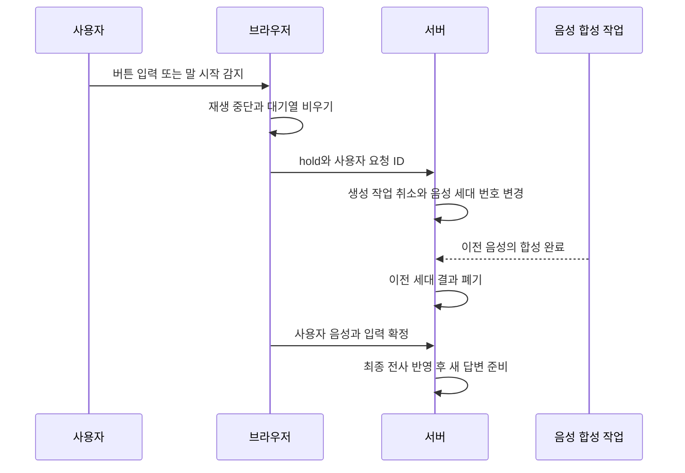

# Banter의 문제 해결과 검증

Banter는 사용자 한 명과 AI 두 명이 참여하는 음성 대화 시스템이다. 사용자가 듣다가
끼어들면 소리를 멈추고 새 입력을 반영해야 한다. 이 문서는 그 과정에서 선택한 구조와
확인 근거를 설명한다. 실행 방법과 현재 검증 상태는 [README](../README.md)에 있다.

실시간 서버의 작업 제어는 FastAPI와 asyncio가 담당한다. LangGraph는 공유 대화 로직으로
평가용 그래프를 구성한다. 프레임워크 간 속도를 비교한 실험은 없으며, 아래 비교는 애플리케이션
구조와 대화 시나리오를 대상으로 한다.

## 기술의 역할과 선택 이유

| 선택 | 맡는 역할과 이유 | 대안과 한계 |
| --- | --- | --- |
| Python과 FastAPI | HTTP와 WebSocket 진입점을 두고, 대화 함수와 공급자 인터페이스를 평가 코드와 공유 | 다른 언어와 프레임워크로도 가능. 개발과 검증 경로를 함께 관리하기 위한 선택이며 성능 비교 결과는 없음 |
| asyncio | 외부 API 응답을 기다리는 동안 입력 수신과 음성 합성을 함께 진행 | 순차 대기는 개입 처리를 늦춤. 작업 취소만으로 늦은 결과가 사라지지 않아 식별자 검사도 필요 |
| WebSocket | 입력, 음성, 중단과 재생 확인 이벤트를 양방향 전달 | SSE를 쓰면 입력용 경로가 별도로 필요. WebRTC는 미디어 전송의 대안이지만 현재 전송과 비교한 실측은 없음 |
| STT, LLM, TTS 분리 | 전사 확정, 화자 선택, 합성과 재생의 상태를 각각 관찰하고 제어 | 음성 입출력을 통합한 모델도 대안. 단계별 대기와 직접 관리할 상태가 늘어나는 비용이 있음 |
| LangGraph | 평가 시나리오의 화자 선택, 발화와 상태 갱신 단계를 명시 | 현재 순차 그래프는 일반 함수로도 구현 가능. 실시간 서버의 중단과 동시 실행은 asyncio가 담당 |
| 인메모리 세션 | 연결별 대화 상태를 보관하고 끼어들기 제어에 집중 | DB를 도입하지 않아 서버 재시작 후 대화 복원과 사용자별 영속 기록은 제공하지 않음 |

두 AI는 하나의 서버가 화자와 진행을 제어하는 페르소나다. 각각 독립 서비스로 배포한 구조는
아니다. Langfuse는 설정 시 평가 대화와 점수를 기록하는 선택 기능이며, 지연 이벤트는 별도
JSONL 기록으로 다룬다. 기술별 상세 배경은 [설계 결정](decisions.md)에 있다.

## 사례 1. 생성 중 입력 수신과 늦은 결과 격리

### 문제

응답 생성, 음성 합성과 브라우저 재생은 서로 다른 시점에 끝난다. 생성 작업을 취소하더라도
이미 합성 중인 음성이 나중에 도착할 수 있고, 서버가 멈춰도 브라우저에는 재생할 음성이 남는다.
스트리밍 전송 검수에서는 청크 전송 대기가 같은 수신 경로의 취소와 다음 입력을 지연시키는
문제도 모의 공급자로 재현했다.

### 선택과 동작

일반 응답 생성 경로는 입력 수신과 답변 생성을 별도 비동기 작업으로 실행하고, 둘 중 먼저 준비된 결과를 처리한다.
사용자 개입을 받으면 앱의 생성 작업에 취소를 요청한다. 브라우저는 서버 왕복을 기다리지 않고
재생 중인 음성을 멈추고 대기열을 비운다. `hold`는 아직 전사되지 않은 음성을 기다리는 동안
새 AI 턴이 시작되지 않도록 사용자에게 발언권을 먼저 준다.

음성 합성에는 `tts_epoch`라는 세대 번호를 붙인다. 합성 전과 후에 현재 번호와 비교하므로,
취소 이후 늦게 완료된 이전 음성도 보내지 않는다. 사용자 발화의 `client_event_id`는 별도로
관리해 이전 전사 결과가 새로운 텍스트나 다음 음성 입력에 섞이지 않게 한다. AI 생성의
`generation_id`는 생성과 무효화 이벤트를 연결하는 기록에 사용한다.

스트리밍 STT도 발화마다 하나의 순차 전송 작업을 둔다. 수신 경로는 청크를 검증하고 제한된
대기열에 추가하며, 작업이 청크와 마지막 commit을 순서대로 보낸다. 청크마다 독립 작업을
만드는 방식은 순서 제어가 더 필요하고, 제한 시간만 줄이는 방식은 전송을 기다리는 동안
입력을 처리하지 못하는 문제를 남긴다. 선택한 방식은 순서를 유지하면서 취소와 새 입력을
계속 받을 수 있게 한다. 대기열 초과와 기한 만료는 명시적인 오류로 처리한다.

### 검증과 한계

| 재현한 상황 | 확인 내용 | 회귀 테스트 |
| --- | --- | --- |
| 합성을 멈춰 두었다가 사용자 개입 후 완료 | 이전 세대의 음성을 보내지 않음 | `test_ws_hold_drops_tts_that_finishes_after_invalidation` |
| 생성 완료와 hold를 동시에 준비 | 완료된 생성이 살아 있는 취소 대상으로 남지 않음 | `test_ws_simultaneous_hold_and_stream_completion_has_no_stale_generation` |
| 전사 대기 중 새 텍스트를 보내고 이전 전사를 늦게 완료 | 이전 전사가 화면과 새 대화 입력에 섞이지 않음 | `test_ws_text_input_cancels_pending_finish_and_drops_late_transcript` |
| 음성 청크 전송과 연결 정리가 지연된 동안 텍스트 입력 | 이전 전송 완료를 기다리지 않고 새 입력 처리 | `test_ws_text_input_preempts_blocked_append_and_slow_cancel` |

이 테스트는 [API 회귀 테스트](../server/tests/test_api.py)에 있다. 가짜 공급자의 완료 순서를
통제한 검증으로, 실제 반응 속도 측정은 아니다. 코드의 주요 위치는
[입력과 생성 제어](../server/api/app.py)의 `_stream_turn`, `_tts_worker`와
[발화별 순차 전송](../server/api/stt_stream.py)의 `StreamingSTTRequest`다.

작업 취소는 외부 공급자의 연산이나 과금이 즉시 중단됨을 보장하지 않는다. 응답 없는 연결의
종료도 별도로 검사했다. 실제 SDK와 WebSocket 프로토콜을 메모리 전송 계층에 연결한
[연결 정리 테스트](../server/tests/test_realtime_stt.py)는 종료 응답 누락과 쓰기 지연을 재현한다.
실제 `4000` 오류의 수정 후 재발 여부는 아직 별도 확인이 필요하다.
변경 전 실패와 수정 후 통과 기록은 [스트리밍 STT 복구 기록](experiments/streaming-stt-ab.md#전송-지연과-연결-종료-복구)에 있다.

## 사례 2. 응답 준비와 재생 진행의 분리

### 문제

화자 선택을 기다린 뒤 대사를 만들고, 전체 대사가 끝난 뒤 음성을 합성하면 첫 음성까지의
대기가 누적된다. 반대로 준비가 끝난 발화를 곧바로 이어 보내면 사용자는 이전 음성을 듣고
있는데 서버의 대화는 다음 턴으로 진행할 수 있다. 준비와 재생을 다른 단계로 다뤄야 했다.

### 선택과 비교

| 변경 | 선택 이유 | 비용과 범위 |
| --- | --- | --- |
| 화자 선택과 대사 생성을 단일 LLM 호출로 통합 | 순차적인 두 요청 중 한 번의 응답 대기를 줄임 | 초기에는 원인 분리를 위해 두 단계로 개발. 통합 응답의 화자와 형식 검사가 필요 |
| 완성된 문장부터 TTS 대기열에 추가 | 전체 대사 생성이 끝나기 전에 첫 문장 합성을 시작 | 문장 순서는 한 작업이 보존. 공급자의 한 요청에서 오디오 조각을 받는 방식과는 구분 |
| 현재 음성 재생 중 다음 AI 발화를 미리 준비 | 사용자가 침묵한 채 듣는 경우 다음 턴 준비 시간을 재생과 겹침 | 사용자 입력이 확정되면 미리 준비한 결과를 폐기. 생성과 합성 비용이 낭비될 수 있음 |
| 음성 순번과 브라우저 처리 확인으로 다음 턴 진행 | 생성 속도와 재생 속도의 차이를 조절 | 확인 유실에는 제한 시간이 필요. 처리 확인은 사용자가 끝까지 들었다는 증명이 아님 |

분리 방식과 통합 방식의 비교는 시나리오별 3회 실행으로 기록했다.
사용자 참여 점수는 8.08에서 8.33, AI 대화 점수는 8.26에서 8.47이었다.
두 시나리오의 종합점수가 당시 이행 기준을 통과해 정상 경로의 LLM 호출을 2회에서 1회로 줄였다.
기록에는 생동감 점수가 9.3에서 8.7로 낮아진 항목도 있다. 모든 품질 항목이 유지되거나
개선된 것은 아니며, 이 값은 통계적 우위나 API 비용 절감률을 입증하지 않는다.
[비교 기록](experiments/judge-scores.md)과 [출력 계약](../server/engine/graph/supervisor.py)을 함께 확인할 수 있다.

사전 준비한 발화는 실제 사용자 텍스트나 최종 전사가 반영될 때 폐기한다. `hold`만 들어왔을 때
모든 사전 작업을 즉시 중단하는 구조는 아니다. 사용자가 아직 말하지 않은 내용에 대한 응답은
미리 준비할 수 없으므로, 이 최적화가 사용자 응답 지연 전체를 해결하지는 않는다.

브라우저는 각 음성의 `seq`와 함께 `played` 확인을 보낸다. 확인에는 정상 재생뿐 아니라
중단하거나 폐기한 항목도 포함된다. 서버는 처리된 가장 큰 순번을 기억하고, 확인을 계속 받지
못하면 제한 시간 후 대기를 해제한다. 따라서 다음 발화를 준비하는 작업과 실제로 내보내는
시점을 분리할 수 있다.

### 검증과 한계

[API 회귀 테스트](../server/tests/test_api.py)의 문장별 전송, 사용자 입력 후 사전 결과 폐기,
재생 확인과 확인 유실 검사가 이 경로를 다룬다. 대표 항목은
`test_ws_sentence_streaming_emits_audio_per_sentence`,
`test_ws_user_say_discards_prefetch_and_reaches_prompt`,
`test_ws_waits_played_ack_before_next_radio_turn`, `test_ws_completes_without_any_acks`다.

과거 로컬 3턴에서는 재생 확인부터 다음 오디오 도착까지 평균 2.09초를 관찰했다. 당시에는
대화 대기도 5초에서 1.5초로 변경되어, 이전 약 8초와의 차이를 prefetch 단독 효과로 분리할 수
없다. 문장 TTS의 약 2.4초 관찰도 텍스트 입력 기준이며 STT를 포함하지 않는다.
측정 조건과 제외 표본은 [지연 기록](experiments/latency.md)에 보존했다.

현재 대화 이력은 생성한 텍스트를 기준으로 한다. 이미 완성된 발화나 사전 준비한 발화가
재생 도중 끊기면 전체 대사가 이력에 남을 수 있다. 실제로 들은 내용과의 일치는 후속 과제다.

### 미완료 사전 생성 대기의 입력 지연

2026-09-28 코드 검수에서 별도의 대기 경로가 입력을 지연시키는 것을 메모리 재현으로 확인했다.
당시 기존 전체 테스트 217개는 통과했지만 아래 경계를 다루지 않았다. 먼저 회귀 8개를 추가해
수정 전 코드에서 7개가 실패하는 것을 확인한 뒤 입력 대기 경로를 수정했다.

1. 가짜 LLM의 다음 발화 준비를 멈춰 둔다.
2. 현재 음성의 `played` 확인과 사용자 참여 대기가 끝나도록 한다.
3. 서버가 `pre = await prefetch`에서 기다릴 때 `hold`와 새 텍스트를 보낸다.
4. 사전 생성 작업을 완료시켜 입력 처리와 전송의 순서를 확인한다.

관찰한 결과, 사전 생성을 풀기 전에는 두 입력이 수신 대기열에 남았다. 완료 후에는 이전
맥락의 `start`, `end`, `audio`를 보낸 다음 새 입력을 처리했다. 이 구간에는 일반 생성 경로의
`_stream_turn`과 달리 입력을 함께 기다리는 작업이 없다. 브라우저의 실제 재생이나 지연을
측정한 결과가 아니며, 가짜 LLM과 TTS 및 메모리 소켓으로 서버의 처리 순서만 확인했다.

수정한 `_wait_prefetch`는 사전 생성과 입력을 함께 기다린다. 두 작업이 동시에 완료되면
입력을 먼저 처리한다. `hold`는 턴 수를 올리지 않고 기존 전사 대기로 돌아가며, 최종 전사나
텍스트가 확정되면 이전 사전 생성 결과를 버리고 새 맥락으로 응답한다. 발언권이 해제되거나
만료되면 기존 AI 재개 정책을 따른다. 준비 실패는 실시간 생성으로 전환하고, 연결 종료와
세션 취소는 새 응답을 시작하지 않고 작업을 정리한다.

[사전 생성 회귀](../server/tests/test_prefetch.py)는 가짜 공급자의 완료 시점을 제어해
입력 처리, 발언권 유지, 이전 결과 폐기, 다음 대화 복구와 취소 경계를 확인한다.
수신 작업 취소 중 이미 소비한 입력이 반환되는 경우도 보존하되, 세션 자체가 취소되면
입력을 처리하지 않고 종료한다. 시간 제한은 테스트 정지 방지용이며 응답 속도 수치가 아니다.

기존 공급자 작업에는 취소를 요청한 뒤 종료를 기다리는 정책을 유지한다. 취소 요청에도
끝나지 않는 공급자까지 즉시 복구한다고 보장하지 않으며, 외부 연산과 과금 중단 역시 별도다.

## 사례 3. 끼어들기를 평가하지 못한 테스트 수정

### 문제

초기 끼어들기 시나리오는 GO 7.6을 받았지만, 검수에서 평가 입력이 의도와 다르다는 것을
발견했다. 테스트용 개입 처리가 AI 발화 텍스트를 자르지 않았고, 중단 표시도 judge에 전달되지
않았다. 평가 모델은 완성된 AI 발화 다음에 사용자가 말한 일반 대화를 보고 있었다.

### 선택과 수정

기존 점수를 끼어들기 대응의 근거로 쓰지 않고 무효로 정정했다. 평가용 개입 처리가 직전
발화를 중간에서 자르고, `Turn.interrupted`가 평가 프롬프트까지 전달되도록 수정했다.
그 뒤 같은 종류의 시나리오를 다시 실행했다. 새 측정도 GO 7.6이었지만, 점수가 같다는 사실과
평가가 의도한 상황을 다룬다는 사실은 구분했다.

[평가 실행 코드](../server/engine/eval/harness.py)의 `_interrupt`, `_to_transcript`와
[judge 입력](../server/engine/eval/judge.py)의 `build_prompt`가 관련 경로다.
[평가 회귀 테스트](../server/tests/test_harness.py)의
`test_interrupt_truncates_and_marks_previous_ai`, `test_transcript_carries_interrupted_to_judge`,
`test_run_scenario_handles_interrupt`로 절단, 표시 전달과 시나리오 실행을 확인한다.

### 결과 해석

이 실험은 텍스트로 재현한 끼어들기 상황에 대한 LLM 평가다. 실제 소리가 얼마나 빨리 멈추는지
측정하지 않으며, 평가용 텍스트 절단이 실제 재생 위치를 반영하는 기능을 뜻하지도 않는다.
고정 대화를 5회 평가했을 때 같은 점수가 나온 결과 역시 해당 조건의 반복 일치 근거다.
사람의 판단과의 일치나 다른 대화에서의 평가 타당성을 증명하지 않는다.

실패, 정정과 재측정 날짜 및 원래 점수는 [점수 이력](experiments/judge-scores.md)에 남겼다.

## 구현 이후 확인할 항목

| 항목 | 현재 상태 | 다음 확인 |
| --- | --- | --- |
| 미완료 사전 생성 대기 | 입력 동시 처리와 취소 경계를 수정하고 회귀 검증 | 실제 공급자 지연 조건의 체감 효과는 별도 측정 |
| 대화 세션의 책임 | 연결, 발화권, 생성과 재생 상태가 API 모듈에 집중 | 회귀 테스트를 유지하며 세션 제어와 연결 처리의 경계 정리 |
| 버튼과 스트리밍 STT 비교 | 두 코드 경로와 요약 도구 구현 | 같은 조건의 전사 지연, 성공률과 정확도 측정 |
| VAD 선택 모드 | 브라우저 감지와 기존 중단 경로 연결 | 헤드폰과 스피커 조건의 오감지, 놓친 발화와 중간 절단 |
| 오류 후 사용자 발언 기회 | 오류 시 기존 AI 재개 흐름으로 복귀 | 제한된 재시도 대기 정책 비교 |
| 중단된 발화의 이력 | 생성된 텍스트 기준으로 기록 | 재생 도중 끊긴 완성 발화의 중단 표시 반영 |

VAD와 WebRTC는 서로 다른 선택이다. 현재 WebSocket을 유지한 채 감지와 대화 제어를 검증하고,
전송 지연, 지터나 에코가 실제 병목으로 확인되면 전송 방식을 검토한다.
자동 테스트는 외부 공급자 없이 실행할 수 있다. 실제 음성 비교는 비용과 호출 범위를 먼저
정한 뒤 진행하며, 가짜 시간과 테스트 성공 건수를 실제 성능으로 환산하지 않는다.
